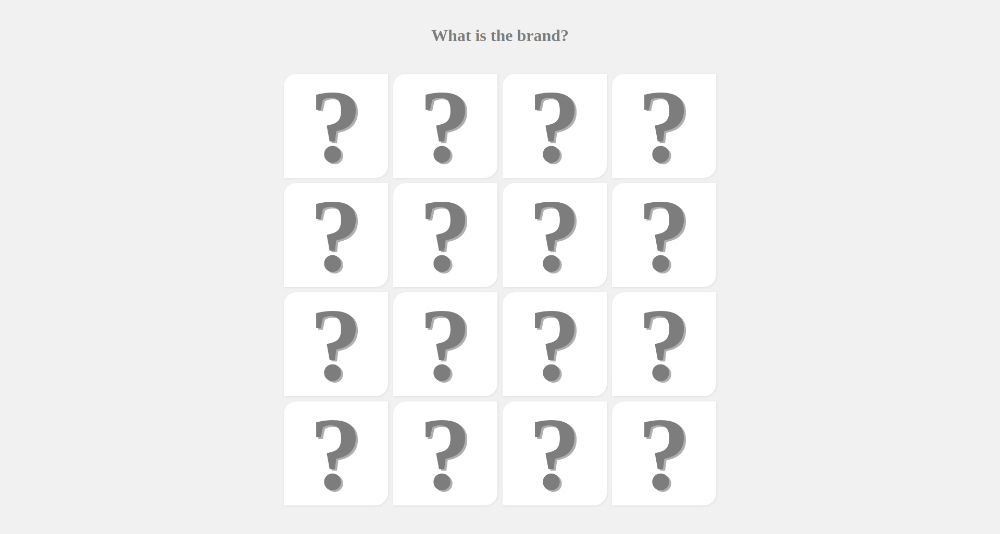
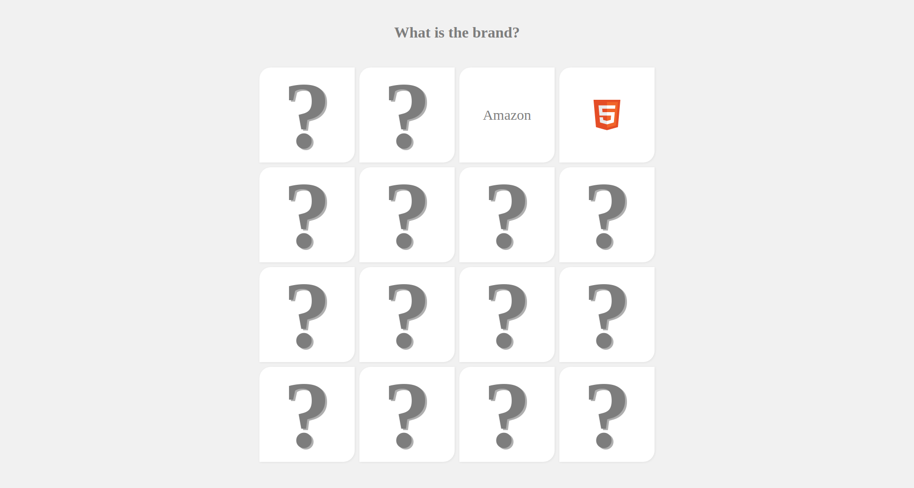
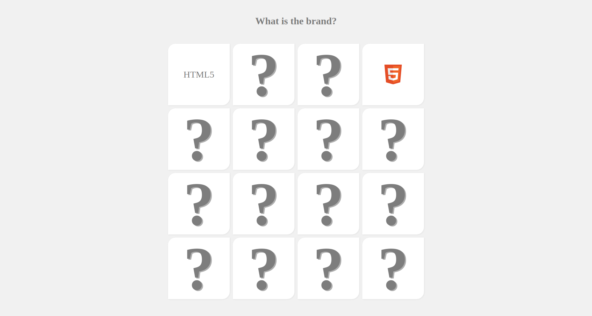

# :copyright: What is the brand?

A Memory Card game made with pure javascript 💜

## 🛠️ Stack

- PUG
- SASS
- Pure javascript
- Webpack 4.0 to transpile SASS into CSS, Pug into HTML and JS ES6 to ES5
- Jest to automated tests (91.46% of coverage)

<p align="center">
  <a></a>
</p>

<p align="center">
  <a></a>
</p>

<p align="center">
  <a></a>
</p>

## Run

```
    npm install
    npm run loc
```

## Run test

```
    npm run test
    npm run test:coverage
```

## :woman: Author

[@laisfrigerio](https://github.com/laisfrigerio/)

## 📄 License

This project is licensed under the MIT License - see the LICENSE.md file for details